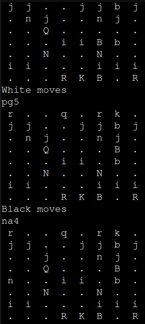
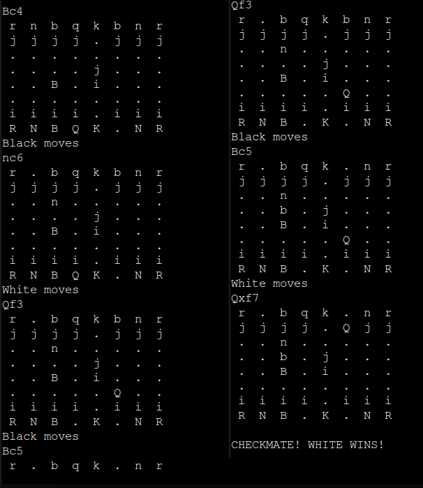

# cli-chess
Started around April 2023. Finished December 24, 2023.

## How to play it?
Install Cargo (the Rust package manager) and run "cargo run" inside the directory. \
<ins>_**Alternatively, copy all the code from main.rs and run it on the Rust Playground.**_<ins/>

The game is viewed as whites, the moves are inputted using SAN (Short Algebraic Notation) \
*i.e. "Nf3" to move a knight to f3* \
*or "bxa3" to take a piece/pawn on a3 with a pawn on the b column*

The simbols on the "board" have the following meaning:
- " . " counts as a square with no pieces or pawns
- " K " or " k " = king
- " Q " or " q " = queen
- " R " or " r " = rook
- " B " or " b " = bishop
- " N " or " n " = knight
- " i " or " j " = white and black pawn, respectively

Uppercase letters indicate white pieces, while lowercase letters indicate black pieces

#### Move input info
- In case of ambiguity (more than one piece can go to the same square), indicate the move normally (i.e. "Re8"). The game will ask for the CURRENT POSITION of the piece, just indicate the square it is currently located ("f8", for example).

- Castling is also possible! It also follows the SAN normally, so for a kingside castle you should input "0-0" or "O-O", while for a queenside castle you should input "0-0-0" or "O-O".

- Every single rule of chess applies, including *en passant*, pawn promotion, king movement rules, stalemates and everything else. If you're familiar with chess websites, expect this to behave similarly!

- In case of check or checkmate moves, there is no need to input "+" or "#" in the moves. The game will only use the position and the piece you inputted for the move.

## How does it work?
The actual board was made in an unidimentional array, in which every element holds a char. The inputted move is checked for a letter that indicates a piece in SAN notation. If no piece is indicated, the move is made using a pawn (except for castling, which is made using a unique notation). Every piece has a very unique way of calculating and checking paths, but it all resorts to subtracting and adding to their index in the array.

Most of the code which i found complex to elaborate and understand prior to writing is commented, and many of the design decisions are explained aswell. 

Feel free to look around!

### Game preview:
#### Game of The Century replayed in the CLI Chess

#### Scholar's Checkmate in the CLI Chess
