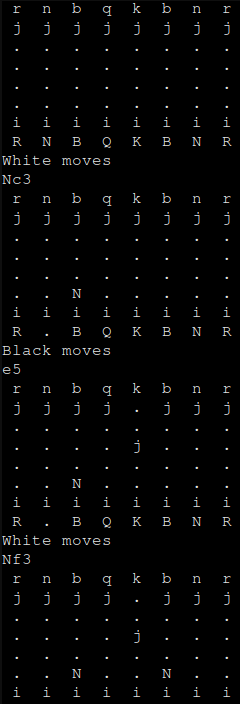

# cli-chess
Started around april 2023, currently WIP

## How to play it?
Install Cargo (the Rust package manager) and run "cargo run" inside the directory 

The game is viewed as whites, the moves are inputted using SAN (Short Algebraic Notation) \
*i.e. "Nf3" to move a knight to f3*

Uppercase letters indicate white pieces, while lowercase letters indicate black pieces \
As for the pawns, " i " and " j " indicate white and black pawns, respectively

- " . " counts as a square with no pieces or pawns
- " K " or " k " = king
- " Q " or " q " = queen
- " R " or " r " = rook
- " B " or " b " = bishop
- " N " or " n " = knight

## How does it work?
The actual board was made in an unidimentional array, in which every element holds a char

The inputted move is checked for a letter that indicates a piece in SAN notation \
if no piece is indicated, the move is made using a pawn

Every piece has a very unique way of calculating and checking paths, but it all resorts to subtracting and adding to their index in the array

### Here's a preview as of Sept. 11 2023:

